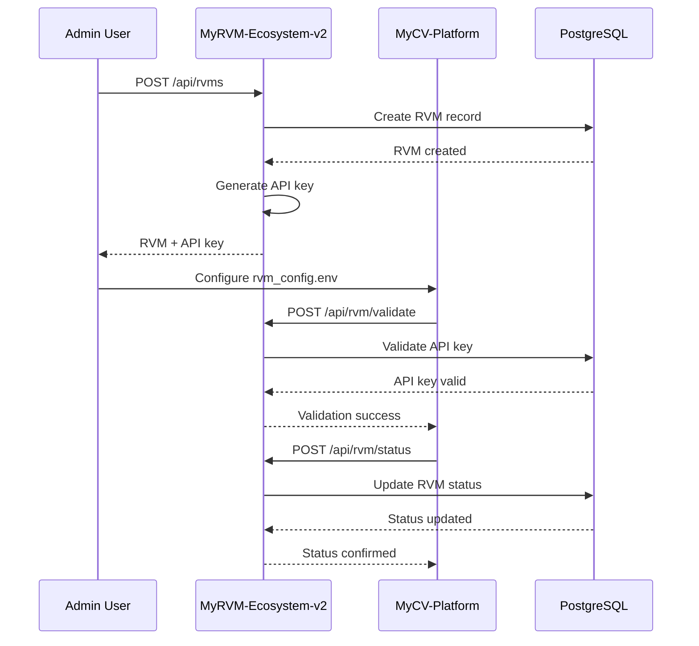
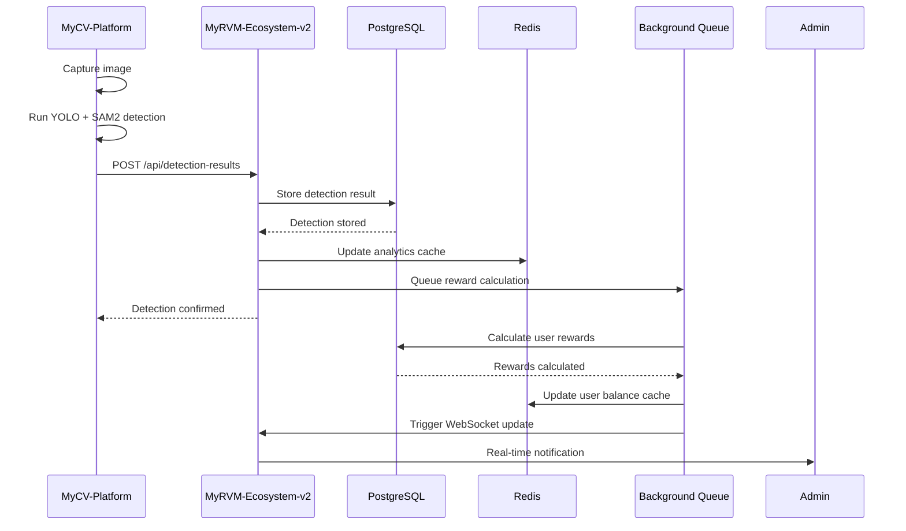
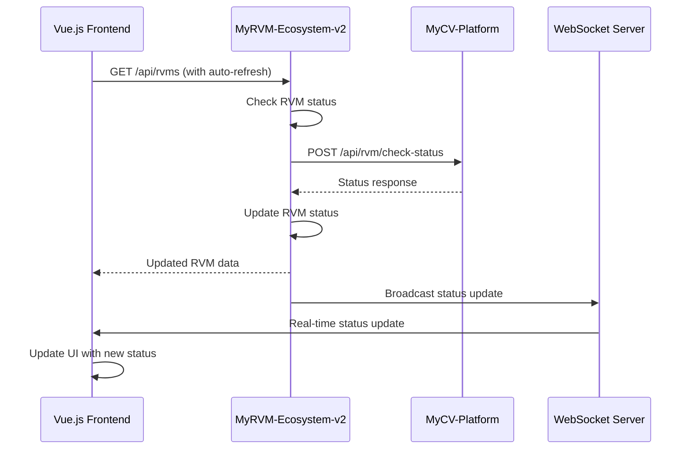

# 🔄 API Integration & Workflow - MyRVM-Ecosystem v2.0

## 📍 Integration Overview

### System Architecture
- **Server (MyRVM-Ecosystem-v2)**: Central management system
- **Jetson (MyCV-Platform)**: Edge computing device for detection
- **Database**: PostgreSQL for data persistence
- **Cache**: Redis for performance optimization
- **Queue**: Background job processing
- **WebSocket**: Real-time communication

---

## 🔄 Integration Workflows

### 1. RVM Registration Workflow


### 2. Detection Processing Workflow


### 3. Real-time Status Update Workflow


---

## 🔧 Integration Implementation

### Server-Side Integration
```php
<?php
// app/Services/RvmIntegrationService.php

namespace App\Services;

use App\Models\ReverseVendingMachine;
use App\Models\DetectionResult;
use Illuminate\Support\Facades\Http;
use Illuminate\Support\Facades\Log;
use Illuminate\Support\Facades\Cache;

class RvmIntegrationService
{
    public function validateRvmConnection(ReverseVendingMachine $rvm): bool
    {
        try {
            $response = Http::timeout(10)
                ->withHeaders([
                    'Authorization' => 'Bearer ' . $rvm->api_key,
                    'Content-Type' => 'application/json'
                ])
                ->post($rvm->getJetsonUrl() . '/api/rvm/validate', [
                    'api_key' => $rvm->api_key
                ]);
            
            if ($response->successful()) {
                $this->updateRvmStatus($rvm, 'online');
                return true;
            }
            
            $this->updateRvmStatus($rvm, 'offline');
            return false;
            
        } catch (\Exception $e) {
            Log::error('RVM connection validation failed', [
                'rvm_id' => $rvm->id,
                'error' => $e->getMessage()
            ]);
            
            $this->updateRvmStatus($rvm, 'offline');
            return false;
        }
    }
    
    public function processDetectionResult(array $data): DetectionResult
    {
        $rvm = ReverseVendingMachine::findOrFail($data['rvm_id']);
        
        // Validate RVM is online
        if (!$this->validateRvmConnection($rvm)) {
            throw new \Exception('RVM is offline');
        }
        
        // Create detection result
        $detectionResult = DetectionResult::create([
            'rvm_id' => $rvm->id,
            'image_path' => $data['image_path'],
            'detection_results' => $data['detection_results'],
            'processing_time' => $data['processing_time'] ?? 0
        ]);
        
        // Update RVM last activity
        $rvm->update([
            'last_detection' => now(),
            'current_load' => $this->calculateCurrentLoad($rvm, $data['detection_results'])
        ]);
        
        // Trigger reward calculation
        $this->queueRewardCalculation($detectionResult);
        
        // Update analytics cache
        $this->updateAnalyticsCache($rvm);
        
        return $detectionResult;
    }
    
    private function updateRvmStatus(ReverseVendingMachine $rvm, string $status): void
    {
        $rvm->update([
            'status' => $status,
            'last_ping' => now()
        ]);
        
        // Clear RVM cache
        Cache::forget("rvm_details_{$rvm->id}");
        Cache::forget("rvms_list_*");
    }
    
    private function calculateCurrentLoad(ReverseVendingMachine $rvm, array $detections): int
    {
        $detectionCount = count($detections);
        $newLoad = $rvm->current_load + $detectionCount;
        
        return min($newLoad, $rvm->capacity);
    }
    
    private function queueRewardCalculation(DetectionResult $detectionResult): void
    {
        // Queue background job for reward calculation
        \App\Jobs\CalculateRewards::dispatch($detectionResult);
    }
    
    private function updateAnalyticsCache(ReverseVendingMachine $rvm): void
    {
        $cacheKey = "rvm_analytics_{$rvm->id}";
        Cache::forget($cacheKey);
        
        // Warm up cache
        $this->getRvmAnalytics($rvm);
    }
    
    public function getRvmAnalytics(ReverseVendingMachine $rvm): array
    {
        $cacheKey = "rvm_analytics_{$rvm->id}";
        
        return Cache::remember($cacheKey, 600, function () use ($rvm) {
            return [
                'total_detections' => $rvm->detectionResults()->count(),
                'today_detections' => $rvm->detectionResults()
                    ->whereDate('created_at', today())
                    ->count(),
                'avg_processing_time' => $rvm->detectionResults()
                    ->avg('processing_time'),
                'last_detection' => $rvm->detectionResults()
                    ->latest()
                    ->first()?->created_at,
                'load_percentage' => ($rvm->current_load / $rvm->capacity) * 100
            ];
        });
    }
}
```

### Jetson-Side Integration
```python
# utils/integration_manager.py

import requests
import time
import logging
from typing import Dict, Any, Optional
import json

logger = logging.getLogger(__name__)

class IntegrationManager:
    def __init__(self, server_url: str, api_key: str):
        self.server_url = server_url
        self.api_key = api_key
        self.headers = {
            'Authorization': f'Bearer {api_key}',
            'Content-Type': 'application/json'
        }
        self.rvm_id = None
        self.is_connected = False
    
    def initialize_connection(self) -> bool:
        """Initialize connection with server"""
        try:
            # Validate API key
            response = requests.post(
                f"{self.server_url}/api/rvm/validate",
                headers=self.headers,
                json={'api_key': self.api_key},
                timeout=10
            )
            
            if response.status_code == 200:
                data = response.json()
                self.rvm_id = data.get('rvm_id')
                self.is_connected = True
                logger.info(f"Connected to server as RVM {self.rvm_id}")
                return True
            else:
                logger.error(f"Failed to validate API key: {response.status_code}")
                return False
                
        except Exception as e:
            logger.error(f"Connection initialization failed: {e}")
            return False
    
    def send_detection_result(self, detection_data: Dict[str, Any]) -> bool:
        """Send detection result to server"""
        if not self.is_connected:
            logger.error("Not connected to server")
            return False
        
        try:
            # Add RVM ID to detection data
            detection_data['rvm_id'] = self.rvm_id
            
            response = requests.post(
                f"{self.server_url}/api/detection-results",
                headers=self.headers,
                json=detection_data,
                timeout=30
            )
            
            if response.status_code == 201:
                logger.info("Detection result sent successfully")
                return True
            else:
                logger.error(f"Failed to send detection result: {response.status_code}")
                return False
                
        except Exception as e:
            logger.error(f"Failed to send detection result: {e}")
            return False
    
    def update_status(self, status_data: Dict[str, Any]) -> bool:
        """Update RVM status on server"""
        if not self.is_connected:
            logger.error("Not connected to server")
            return False
        
        try:
            response = requests.post(
                f"{self.server_url}/api/rvm/status",
                headers=self.headers,
                json=status_data,
                timeout=10
            )
            
            if response.status_code == 200:
                logger.info("Status updated successfully")
                return True
            else:
                logger.error(f"Failed to update status: {response.status_code}")
                return False
                
        except Exception as e:
            logger.error(f"Failed to update status: {e}")
            return False
    
    def get_rvm_info(self) -> Optional[Dict[str, Any]]:
        """Get RVM information from server"""
        if not self.is_connected:
            logger.error("Not connected to server")
            return None
        
        try:
            response = requests.get(
                f"{self.server_url}/api/rvm/info",
                headers=self.headers,
                timeout=10
            )
            
            if response.status_code == 200:
                return response.json()
            else:
                logger.error(f"Failed to get RVM info: {response.status_code}")
                return None
                
        except Exception as e:
            logger.error(f"Failed to get RVM info: {e}")
            return None
    
    def health_check(self) -> bool:
        """Perform health check with server"""
        try:
            response = requests.get(
                f"{self.server_url}/api/health",
                timeout=5
            )
            
            if response.status_code == 200:
                logger.info("Server health check passed")
                return True
            else:
                logger.error(f"Server health check failed: {response.status_code}")
                return False
                
        except Exception as e:
            logger.error(f"Server health check failed: {e}")
            return False
    
    def reconnect(self) -> bool:
        """Reconnect to server"""
        logger.info("Attempting to reconnect to server...")
        self.is_connected = False
        return self.initialize_connection()

# Global integration manager instance
integration_manager = None

def initialize_integration(server_url: str, api_key: str) -> bool:
    """Initialize integration with server"""
    global integration_manager
    integration_manager = IntegrationManager(server_url, api_key)
    return integration_manager.initialize_connection()

def send_detection_result(detection_data: Dict[str, Any]) -> bool:
    """Send detection result to server"""
    global integration_manager
    if integration_manager:
        return integration_manager.send_detection_result(detection_data)
    return False

def update_status(status_data: Dict[str, Any]) -> bool:
    """Update RVM status on server"""
    global integration_manager
    if integration_manager:
        return integration_manager.update_status(status_data)
    return False
```

---

## 🔄 Real-time Communication

### WebSocket Integration
```php
<?php
// app/Http/Controllers/WebSocketController.php

namespace App\Http\Controllers;

use App\Http\Controllers\Controller;
use Illuminate\Http\Request;
use Pusher\Pusher;
use App\Models\ReverseVendingMachine;
use App\Models\DetectionResult;

class WebSocketController extends Controller
{
    private $pusher;
    
    public function __construct()
    {
        $this->pusher = new Pusher(
            config('broadcasting.connections.pusher.key'),
            config('broadcasting.connections.pusher.secret'),
            config('broadcasting.connections.pusher.app_id'),
            config('broadcasting.connections.pusher.options')
        );
    }
    
    public function broadcastRvmUpdate(ReverseVendingMachine $rvm)
    {
        $this->pusher->trigger('rvm-updates', 'rvm.updated', [
            'rvm_id' => $rvm->id,
            'name' => $rvm->name,
            'status' => $rvm->status,
            'current_load' => $rvm->current_load,
            'capacity' => $rvm->capacity,
            'last_ping' => $rvm->last_ping,
            'timestamp' => now()->toISOString()
        ]);
    }
    
    public function broadcastDetectionUpdate(DetectionResult $detection)
    {
        $this->pusher->trigger('detection-updates', 'detection.created', [
            'detection_id' => $detection->id,
            'rvm_id' => $detection->rvm_id,
            'detection_results' => $detection->detection_results,
            'processing_time' => $detection->processing_time,
            'timestamp' => $detection->created_at->toISOString()
        ]);
    }
    
    public function broadcastSystemAlert(array $alert)
    {
        $this->pusher->trigger('system-alerts', 'alert.created', [
            'type' => $alert['type'],
            'message' => $alert['message'],
            'severity' => $alert['severity'],
            'timestamp' => now()->toISOString()
        ]);
    }
}
```

### Frontend WebSocket Integration
```javascript
// resources/js/utils/websocket.js

import Echo from 'laravel-echo';
import Pusher from 'pusher-js';

window.Pusher = Pusher;

const echo = new Echo({
    broadcaster: 'pusher',
    key: process.env.MIX_PUSHER_APP_KEY,
    cluster: process.env.MIX_PUSHER_APP_CLUSTER,
    forceTLS: true
});

export default echo;

// RVM updates listener
echo.channel('rvm-updates')
    .listen('rvm.updated', (data) => {
        console.log('RVM updated:', data);
        // Update RVM data in store
        updateRvmData(data);
    });

// Detection updates listener
echo.channel('detection-updates')
    .listen('detection.created', (data) => {
        console.log('New detection:', data);
        // Update detection data in store
        updateDetectionData(data);
    });

// System alerts listener
echo.channel('system-alerts')
    .listen('alert.created', (data) => {
        console.log('System alert:', data);
        // Show alert notification
        showAlert(data);
    });

function updateRvmData(data) {
    // Update RVM data in Vuex store or component state
    if (window.vueApp && window.vueApp.$store) {
        window.vueApp.$store.commit('updateRvm', data);
    }
}

function updateDetectionData(data) {
    // Update detection data in Vuex store or component state
    if (window.vueApp && window.vueApp.$store) {
        window.vueApp.$store.commit('addDetection', data);
    }
}

function showAlert(data) {
    // Show alert notification
    if (window.vueApp && window.vueApp.$toast) {
        window.vueApp.$toast[data.severity](data.message);
    }
}
```

---

## 🔄 Background Job Processing

### Queue Jobs
```php
<?php
// app/Jobs/CalculateRewards.php

namespace App\Jobs;

use App\Models\DetectionResult;
use App\Models\User;
use App\Services\RewardCalculationService;
use Illuminate\Bus\Queueable;
use Illuminate\Contracts\Queue\ShouldQueue;
use Illuminate\Foundation\Bus\Dispatchable;
use Illuminate\Queue\InteractsWithQueue;
use Illuminate\Queue\SerializesModels;
use Illuminate\Support\Facades\Log;

class CalculateRewards implements ShouldQueue
{
    use Dispatchable, InteractsWithQueue, Queueable, SerializesModels;
    
    protected $detectionResult;
    
    public function __construct(DetectionResult $detectionResult)
    {
        $this->detectionResult = $detectionResult;
    }
    
    public function handle(RewardCalculationService $rewardService)
    {
        try {
            $rewards = $rewardService->calculateRewards($this->detectionResult);
            
            // Update user balances
            foreach ($rewards as $userId => $amount) {
                $user = User::find($userId);
                if ($user) {
                    $user->addBalance($amount, 'detection_reward', [
                        'detection_id' => $this->detectionResult->id,
                        'rvm_id' => $this->detectionResult->rvm_id
                    ]);
                }
            }
            
            Log::info('Rewards calculated successfully', [
                'detection_id' => $this->detectionResult->id,
                'rewards' => $rewards
            ]);
            
        } catch (\Exception $e) {
            Log::error('Reward calculation failed', [
                'detection_id' => $this->detectionResult->id,
                'error' => $e->getMessage()
            ]);
            
            throw $e;
        }
    }
}

// app/Jobs/UpdateAnalytics.php
class UpdateAnalytics implements ShouldQueue
{
    use Dispatchable, InteractsWithQueue, Queueable, SerializesModels;
    
    protected $rvmId;
    
    public function __construct(int $rvmId)
    {
        $this->rvmId = $rvmId;
    }
    
    public function handle()
    {
        $rvm = ReverseVendingMachine::find($this->rvmId);
        if (!$rvm) {
            return;
        }
        
        // Update analytics cache
        $analytics = [
            'total_detections' => $rvm->detectionResults()->count(),
            'today_detections' => $rvm->detectionResults()
                ->whereDate('created_at', today())
                ->count(),
            'avg_processing_time' => $rvm->detectionResults()
                ->avg('processing_time'),
            'last_detection' => $rvm->detectionResults()
                ->latest()
                ->first()?->created_at,
            'load_percentage' => ($rvm->current_load / $rvm->capacity) * 100
        ];
        
        Cache::put("rvm_analytics_{$this->rvmId}", $analytics, 600);
        
        // Broadcast update
        app(WebSocketController::class)->broadcastRvmUpdate($rvm);
    }
}
```

---

## 🔄 Data Synchronization

### Data Sync Service
```php
<?php
// app/Services/DataSyncService.php

namespace App\Services;

use App\Models\ReverseVendingMachine;
use App\Models\DetectionResult;
use Illuminate\Support\Facades\Http;
use Illuminate\Support\Facades\Log;
use Illuminate\Support\Facades\Cache;

class DataSyncService
{
    public function syncRvmData(ReverseVendingMachine $rvm): bool
    {
        try {
            $response = Http::timeout(30)
                ->withHeaders([
                    'Authorization' => 'Bearer ' . $rvm->api_key,
                    'Content-Type' => 'application/json'
                ])
                ->get($rvm->getJetsonUrl() . '/api/rvm/sync');
            
            if ($response->successful()) {
                $data = $response->json();
                
                // Update RVM data
                $rvm->update([
                    'current_load' => $data['current_load'],
                    'last_sync' => now()
                ]);
                
                // Clear cache
                Cache::forget("rvm_details_{$rvm->id}");
                
                return true;
            }
            
            return false;
            
        } catch (\Exception $e) {
            Log::error('RVM data sync failed', [
                'rvm_id' => $rvm->id,
                'error' => $e->getMessage()
            ]);
            
            return false;
        }
    }
    
    public function syncDetectionResults(ReverseVendingMachine $rvm): int
    {
        $syncedCount = 0;
        
        try {
            $response = Http::timeout(60)
                ->withHeaders([
                    'Authorization' => 'Bearer ' . $rvm->api_key,
                    'Content-Type' => 'application/json'
                ])
                ->get($rvm->getJetsonUrl() . '/api/detection-results/sync');
            
            if ($response->successful()) {
                $data = $response->json();
                
                foreach ($data['detections'] as $detectionData) {
                    DetectionResult::updateOrCreate(
                        ['external_id' => $detectionData['id']],
                        [
                            'rvm_id' => $rvm->id,
                            'image_path' => $detectionData['image_path'],
                            'detection_results' => $detectionData['detection_results'],
                            'processing_time' => $detectionData['processing_time'],
                            'created_at' => $detectionData['created_at']
                        ]
                    );
                    
                    $syncedCount++;
                }
            }
            
        } catch (\Exception $e) {
            Log::error('Detection results sync failed', [
                'rvm_id' => $rvm->id,
                'error' => $e->getMessage()
            ]);
        }
        
        return $syncedCount;
    }
    
    public function syncAllRvmData(): array
    {
        $results = [];
        $rvms = ReverseVendingMachine::whereNotNull('ip_address')->get();
        
        foreach ($rvms as $rvm) {
            $results[$rvm->id] = [
                'rvm_sync' => $this->syncRvmData($rvm),
                'detection_sync' => $this->syncDetectionResults($rvm)
            ];
        }
        
        return $results;
    }
}
```

---

## 🔄 Integration Testing

### Integration Test Suite
```python
# tests/test_integration.py

import pytest
import requests
import time
import asyncio
import aiohttp
from unittest.mock import patch, MagicMock

class TestIntegration:
    def setup_method(self):
        self.server_url = "http://100.123.143.87:8001"
        self.jetson_url = "http://100.117.234.2:5000"
        self.api_key = "38bbe1d2ecf75df21546b05340f5878a24e74ed0d8b88d75db1ddeff198380c1"
        self.headers = {
            'Authorization': f'Bearer {self.api_key}',
            'Content-Type': 'application/json'
        }
    
    def test_rvm_registration_flow(self):
        """Test complete RVM registration flow"""
        # 1. Create RVM on server
        rvm_data = {
            'name': 'Integration Test RVM',
            'location': 'Test Location',
            'ip_address': '192.168.1.100',
            'capacity': 100
        }
        
        response = requests.post(
            f"{self.server_url}/api/rvms",
            headers=self.headers,
            json=rvm_data
        )
        assert response.status_code == 201
        rvm_id = response.json()['data']['id']
        
        # 2. Validate RVM on Jetson
        response = requests.post(
            f"{self.jetson_url}/api/rvm/validate",
            headers=self.headers,
            json={'api_key': self.api_key}
        )
        assert response.status_code == 200
        assert response.json()['valid'] is True
        
        # 3. Update RVM status
        status_data = {
            'status': 'online',
            'current_load': 0,
            'last_ping': time.time()
        }
        
        response = requests.post(
            f"{self.jetson_url}/api/rvm/status",
            headers=self.headers,
            json=status_data
        )
        assert response.status_code == 200
        
        # 4. Cleanup
        requests.delete(
            f"{self.server_url}/api/rvms/{rvm_id}",
            headers=self.headers
        )
    
    def test_detection_processing_flow(self):
        """Test complete detection processing flow"""
        # 1. Create RVM
        rvm_data = {
            'name': 'Detection Test RVM',
            'location': 'Test Location',
            'ip_address': '192.168.1.101',
            'capacity': 100
        }
        
        response = requests.post(
            f"{self.server_url}/api/rvms",
            headers=self.headers,
            json=rvm_data
        )
        rvm_id = response.json()['data']['id']
        
        # 2. Send detection result
        detection_data = {
            'rvm_id': rvm_id,
            'image_path': '/path/to/test/image.jpg',
            'detection_results': [
                {
                    'class': 'bottle',
                    'confidence': 0.95,
                    'bbox': [100, 100, 200, 200]
                }
            ],
            'processing_time': 1.5
        }
        
        response = requests.post(
            f"{self.jetson_url}/api/detection",
            headers=self.headers,
            json=detection_data
        )
        assert response.status_code == 201
        
        # 3. Verify detection stored on server
        time.sleep(2)  # Wait for sync
        
        response = requests.get(
            f"{self.server_url}/api/detection-results",
            headers=self.headers
        )
        assert response.status_code == 200
        
        detections = response.json()['data']
        assert len(detections) > 0
        
        # 4. Cleanup
        requests.delete(
            f"{self.server_url}/api/rvms/{rvm_id}",
            headers=self.headers
        )
    
    def test_real_time_updates(self):
        """Test real-time updates via WebSocket"""
        # This would require WebSocket testing framework
        # For now, test that endpoints return correct data
        response = requests.get(
            f"{self.server_url}/api/rvms",
            headers=self.headers
        )
        assert response.status_code == 200
        
        rvms = response.json()['data']
        for rvm in rvms:
            assert 'status' in rvm
            assert 'last_ping' in rvm
    
    def test_error_handling_flow(self):
        """Test error handling across the system"""
        # Test invalid API key
        invalid_headers = {
            'Authorization': 'Bearer invalid_key',
            'Content-Type': 'application/json'
        }
        
        response = requests.get(
            f"{self.server_url}/api/rvms",
            headers=invalid_headers
        )
        assert response.status_code == 401
        
        # Test invalid RVM ID
        response = requests.get(
            f"{self.server_url}/api/rvms/99999",
            headers=self.headers
        )
        assert response.status_code == 404
        
        # Test malformed detection data
        invalid_detection = {
            'rvm_id': 'invalid',
            'image_path': '',
            'detection_results': 'not_an_array'
        }
        
        response = requests.post(
            f"{self.jetson_url}/api/detection",
            headers=self.headers,
            json=invalid_detection
        )
        assert response.status_code == 400
    
    def test_performance_under_load(self):
        """Test system performance under load"""
        # Test multiple concurrent requests
        import concurrent.futures
        
        def make_request():
            response = requests.get(
                f"{self.server_url}/api/rvms",
                headers=self.headers,
                timeout=10
            )
            return response.status_code == 200
        
        # Run 20 concurrent requests
        with concurrent.futures.ThreadPoolExecutor(max_workers=20) as executor:
            futures = [executor.submit(make_request) for _ in range(20)]
            results = [future.result() for future in futures]
        
        # All should succeed
        assert all(results)
    
    def test_data_consistency(self):
        """Test data consistency across systems"""
        # Create RVM
        rvm_data = {
            'name': 'Consistency Test RVM',
            'location': 'Test Location',
            'ip_address': '192.168.1.102',
            'capacity': 100
        }
        
        response = requests.post(
            f"{self.server_url}/api/rvms",
            headers=self.headers,
            json=rvm_data
        )
        rvm_id = response.json()['data']['id']
        
        # Update RVM on Jetson
        update_data = {
            'current_load': 50,
            'status': 'online'
        }
        
        response = requests.post(
            f"{self.jetson_url}/api/rvm/status",
            headers=self.headers,
            json=update_data
        )
        assert response.status_code == 200
        
        # Verify update on server
        time.sleep(2)  # Wait for sync
        
        response = requests.get(
            f"{self.server_url}/api/rvms/{rvm_id}",
            headers=self.headers
        )
        assert response.status_code == 200
        
        rvm = response.json()['data']
        assert rvm['current_load'] == 50
        
        # Cleanup
        requests.delete(
            f"{self.server_url}/api/rvms/{rvm_id}",
            headers=self.headers
        )

if __name__ == "__main__":
    pytest.main([__file__, "-v"])
```

---

**Last Updated**: 2025-01-02  
**Version**: 2.0.0  
**Status**: ✅ COMPLETE INTEGRATION & WORKFLOW DOCUMENTATION
