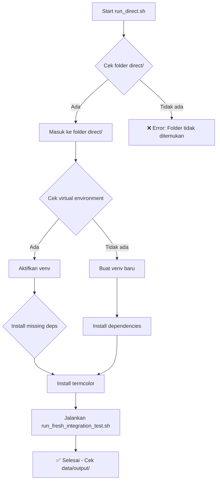

# 🚀 MyCV-Platform Direct Execution

## 📋 Overview

Script `run_direct.sh` adalah launcher utama untuk menjalankan MyCV-Platform secara langsung di VM tanpa menggunakan Docker. Script ini mengatur virtual environment, menginstall dependencies, dan menjalankan fresh integration test dengan YOLO + SAM2.

## 🔗 File Location

**Script:** [`./run_direct.sh`](./run_direct.sh)

## 🎯 Fungsi Utama

1. **Environment Setup** - Membuat dan mengaktifkan virtual environment
2. **Dependency Management** - Menginstall semua dependencies yang diperlukan
3. **Integration Testing** - Menjalankan fresh integration test dengan YOLO + SAM2
4. **Output Management** - Menyimpan hasil di folder `data/output/`

## 📁 Dependencies

### Folder yang Diperlukan:
- ✅ `direct/` - Folder utama aplikasi
- ✅ `direct/venv/` - Virtual environment (dibuat otomatis)
- ✅ `direct/scripts/` - Folder scripts

### File yang Diperlukan:
- ✅ `direct/requirements.txt` - Python dependencies
- ✅ `direct/scripts/run_fresh_integration_test.sh` - Integration test script

## 🚀 Cara Penggunaan

### 1. Persiapan
```bash
# Pastikan berada di root directory MyCV-Platform
cd /path/to/MyCV-Platform

# Pastikan script executable
chmod +x run_direct.sh
```

### 2. Menjalankan
```bash
# Jalankan script
./run_direct.sh
```

### 3. Output
Script akan:
- Membuat virtual environment jika belum ada
- Menginstall dependencies
- Menjalankan fresh integration test
- Menyimpan hasil di `direct/data/output/`

## 📊 Workflow



## 🔧 Konfigurasi

### Virtual Environment
- **Path:** `direct/venv/`
- **Python Version:** Python 3.x
- **Auto-create:** Ya, jika belum ada

### Dependencies
- **Main:** `direct/requirements.txt`
- **Additional:** `termcolor` (auto-install)

### Test Script
- **Script:** `direct/scripts/run_fresh_integration_test.sh`
- **Type:** Standard Version (YOLO + SAM2)

## 📂 Output Structure

Setelah menjalankan script, hasil akan tersimpan di:

```
direct/data/output/
├── integration_results/     # Hasil deteksi dan segmentasi
├── visualizations/          # File visualisasi PNG
└── remote/                  # Output Copy Version (jika ada)
```

## ⚠️ Troubleshooting

### Error: Folder 'direct' tidak ditemukan
```bash
# Pastikan berada di root MyCV-Platform
pwd
# Output harus: /path/to/MyCV-Platform
```

### Error: Virtual environment tidak aktif
```bash
# Script akan membuat venv otomatis
# Jika masih error, hapus dan buat ulang:
rm -rf direct/venv
./run_direct.sh
```

### Error: Dependencies tidak terinstall
```bash
# Script akan install otomatis
# Jika masih error, install manual:
cd direct
source venv/bin/activate
pip install -r requirements.txt
pip install termcolor
```

## 🔄 Related Scripts

- **Standard Version:** [`run_fresh_integration_test.sh`](./direct/scripts/run_fresh_integration_test.sh)
- **Enhanced Version:** [`run_fresh_integration_test-copy.sh`](./direct/scripts/run_fresh_integration_test-copy.sh)
- **Web Application:** [`run_web.sh`](./run_web.sh)
- **Docker Testing:** [`run_docker.sh`](./run_docker.sh)

## 📋 Requirements

### System Requirements:
- ✅ Linux/Unix system
- ✅ Python 3.x
- ✅ pip package manager
- ✅ Git (untuk model download)

### Hardware Requirements:
- ✅ CPU: Multi-core recommended
- ✅ RAM: 8GB+ recommended
- ✅ Storage: 10GB+ free space
- ⚠️ GPU: Optional (CPU-only mode supported)

## 🎯 Use Cases

1. **Development Testing** - Test cepat tanpa Docker
2. **Local Development** - Development environment setup
3. **CI/CD Pipeline** - Automated testing
4. **Production Deployment** - Direct VM deployment

## 📚 Documentation

- **Main README:** [`README.md`](./README.md)
- **Direct Folder:** [`direct/README.md`](./direct/README.md)
- **Scripts Guide:** [`direct/scripts/`](./direct/scripts/)

## 🔗 Quick Links

- **Script File:** [`run_direct.sh`](./run_direct.sh)
- **Integration Test:** [`direct/scripts/run_fresh_integration_test.sh`](./direct/scripts/run_fresh_integration_test.sh)
- **Requirements:** [`direct/requirements.txt`](./direct/requirements.txt)
- **Output Folder:** [`direct/data/output/`](./direct/data/output/)

---

**Last Updated:** September 27, 2025  
**Version:** 1.1.0  
**Status:** ✅ Production Ready
