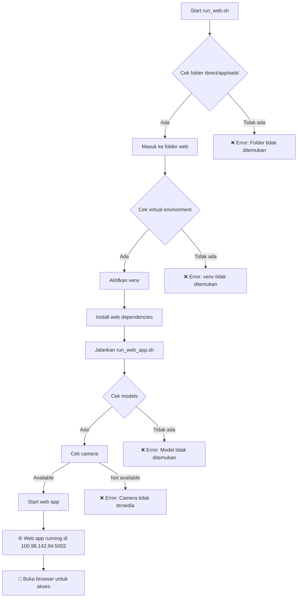

# 🌐 MyCV-Platform Web Application

## 📋 Overview

MyCV-Platform Web Application sekarang terintegrasi dalam **unified architecture** dengan setup script yang bekerja di semua environment. Web application menyediakan interface interaktif untuk deteksi objek dan segmentasi real-time melalui kamera.

## 🔗 File Location

**Web App:** [`direct/app/web/app.py`](./direct/app/web/app.py)  
**Setup:** [`direct/setup.sh`](./direct/setup.sh)

## 🎯 Fungsi Utama

1. **Web Interface** - Menyediakan interface web untuk real-time detection
2. **Camera Integration** - Menggunakan kamera untuk input real-time
3. **YOLO + SAM2 Processing** - Deteksi objek dan segmentasi real-time
4. **Interactive Dashboard** - Dashboard interaktif untuk monitoring hasil
5. **Live Visualization** - Visualisasi hasil detection dan segmentation secara live

## 📁 Dependencies

### Folder yang Diperlukan:
- ✅ `direct/app/web/` - Folder web application
- ✅ `direct/venv/` - Virtual environment (shared)
- ✅ `direct/requirements.txt` - Unified dependencies

### File yang Diperlukan:
- ✅ `direct/setup.sh` - Cross-platform setup script
- ✅ `direct/app/web/app.py` - Web application main file
- ✅ `direct/app/web/templates/index.html` - Web template

## 🚀 Cara Penggunaan

### 1. Setup Environment
```bash
# Masuk ke folder direct
cd MySuperApps/MyCV-Platform/direct

# Setup environment (satu kali)
./setup.sh
```

### 2. Run Web Application
```bash
# Aktifkan virtual environment
source venv/bin/activate

# Run web application
cd app/web
python app.py
pip install -r requirements.txt
cd ..
```

### 2. Menjalankan
```bash
# Jalankan script
./run_web.sh
```

### 3. Akses Web Application
```bash
# Buka browser dan navigasi ke:
http://100.98.142.94:5002
```

### 4. Menghentikan
```bash
# Tekan Ctrl+C di terminal untuk menghentikan aplikasi
```

## 📊 Workflow



## 🔧 Konfigurasi

### Web Application
- **Port:** 5002
- **URL:** http://100.98.142.94:5002
- **Framework:** Flask
- **Template Engine:** Jinja2

### Camera Settings
- **Default Camera:** 0 (first available camera)
- **Resolution:** Auto-detect
- **FPS:** Real-time processing

### Model Configuration
- **YOLO Model:** yolo11m.pt
- **Trained Model:** best.pt
- **SAM Model:** sam2_b.pt

## 📂 File Structure

```
direct/app/web/
├── app.py                 # Main Flask application
├── run_web_app.sh         # Web app launcher
├── requirements.txt       # Web dependencies
├── README.md             # Web app documentation
└── templates/
    └── index.html        # Web interface template
```

## 🌐 Web Interface Features

### **Real-time Detection:**
- ✅ Live camera feed
- ✅ Object detection dengan YOLO
- ✅ Segmentation dengan SAM2
- ✅ Bounding box visualization
- ✅ Mask overlay visualization

### **Interactive Controls:**
- ✅ Start/Stop detection
- ✅ Model selection
- ✅ Confidence threshold adjustment
- ✅ Real-time parameter tuning

### **Visualization Options:**
- ✅ Original camera feed
- ✅ Detection results
- ✅ Segmentation masks
- ✅ Combined visualization
- ✅ Performance metrics

## ⚠️ Troubleshooting

### Error: Folder 'direct/app/web' tidak ditemukan
```bash
# Pastikan struktur folder benar
ls -la direct/app/web/
# Harus ada: app.py, run_web_app.sh, requirements.txt, templates/
```

### Error: Virtual environment tidak ditemukan
```bash
# Buat virtual environment terlebih dahulu
cd direct
python3 -m venv venv
source venv/bin/activate
pip install -r requirements.txt
cd ..
```

### Error: Model tidak ditemukan
```bash
# Install models terlebih dahulu
cd direct
source venv/bin/activate
./scripts/install_models.sh
```

### Error: Camera tidak tersedia
```bash
# Cek camera availability
python3 -c "import cv2; print('Camera available:', cv2.VideoCapture(0).isOpened())"

# Jika camera tidak terdeteksi:
# 1. Cek koneksi camera
# 2. Cek permission camera
# 3. Cek driver camera
```

### Error: Port 5002 sudah digunakan
```bash
# Cek proses yang menggunakan port 5002
sudo lsof -i :5002

# Kill proses jika perlu
sudo kill -9 <PID>

# Atau gunakan port lain dengan mengedit app.py
```

## 🔄 Related Scripts

- **Direct Execution:** [`run_direct.sh`](./run_direct.sh)
- **Docker Testing:** [`run_docker.sh`](./run_docker.sh)
- **Model Installation:** [`direct/scripts/install_models.sh`](./direct/scripts/install_models.sh)
- **Web App Launcher:** [`direct/app/web/run_web_app.sh`](./direct/app/web/run_web_app.sh)

## 📋 Requirements

### System Requirements:
- ✅ Linux/Unix system
- ✅ Python 3.x
- ✅ pip package manager
- ✅ Camera device (USB/webcam)
- ✅ Web browser (Chrome, Firefox, Safari)

### Hardware Requirements:
- ✅ CPU: Multi-core recommended
- ✅ RAM: 8GB+ recommended
- ✅ Storage: 10GB+ free space
- ✅ Camera: USB webcam atau built-in camera
- ⚠️ GPU: Optional (CPU-only mode supported)

### Software Dependencies:
- ✅ OpenCV (cv2) - Camera handling
- ✅ Flask - Web framework
- ✅ Jinja2 - Template engine
- ✅ YOLO models - Object detection
- ✅ SAM2 models - Segmentation

## 🎯 Use Cases

1. **Real-time Monitoring** - Monitoring objek real-time
2. **Interactive Demo** - Demo aplikasi untuk presentasi
3. **Development Testing** - Test web interface
4. **User Interface** - Interface untuk end users
5. **Live Processing** - Processing kamera live

## 🔧 Advanced Configuration

### Custom Port:
```bash
# Edit app.py untuk mengubah port
# Ganti: app.run(host='0.0.0.0', port=5000, debug=True)
# Menjadi: app.run(host='0.0.0.0', port=8080, debug=True)
```

### Custom Camera:
```bash
# Edit app.py untuk mengubah camera index
# Ganti: camera = cv2.VideoCapture(0)
# Menjadi: camera = cv2.VideoCapture(1)  # Camera kedua
```

### Performance Tuning:
```bash
# Edit app.py untuk mengubah processing parameters
# - Confidence threshold
# - Model selection
# - Processing frequency
```

## 📚 Documentation

- **Main README:** [`README.md`](./README.md)
- **Direct Folder:** [`direct/README.md`](./direct/README.md)
- **Web App:** [`direct/app/web/README.md`](./direct/app/web/README.md)
- **Scripts Guide:** [`direct/scripts/`](./direct/scripts/)

## 🔗 Quick Links

- **Script File:** [`run_web.sh`](./run_web.sh)
- **Web App:** [`direct/app/web/app.py`](./direct/app/web/app.py)
- **Web Launcher:** [`direct/app/web/run_web_app.sh`](./direct/app/web/run_web_app.sh)
- **Web Template:** [`direct/app/web/templates/index.html`](./direct/app/web/templates/index.html)
- **Web Requirements:** [`direct/app/web/requirements.txt`](./direct/app/web/requirements.txt)

## 🚀 Quick Start Commands

```bash
# Setup dan jalankan web app
./run_web.sh

# Akses di browser
# http://100.98.142.94:5002

# Stop aplikasi
# Ctrl+C di terminal
```

---

**Last Updated:** September 27, 2025  
**Version:** 1.1.0  
**Status:** ✅ Production Ready  
**Web Interface:** 🌐 Real-time Camera Detection

