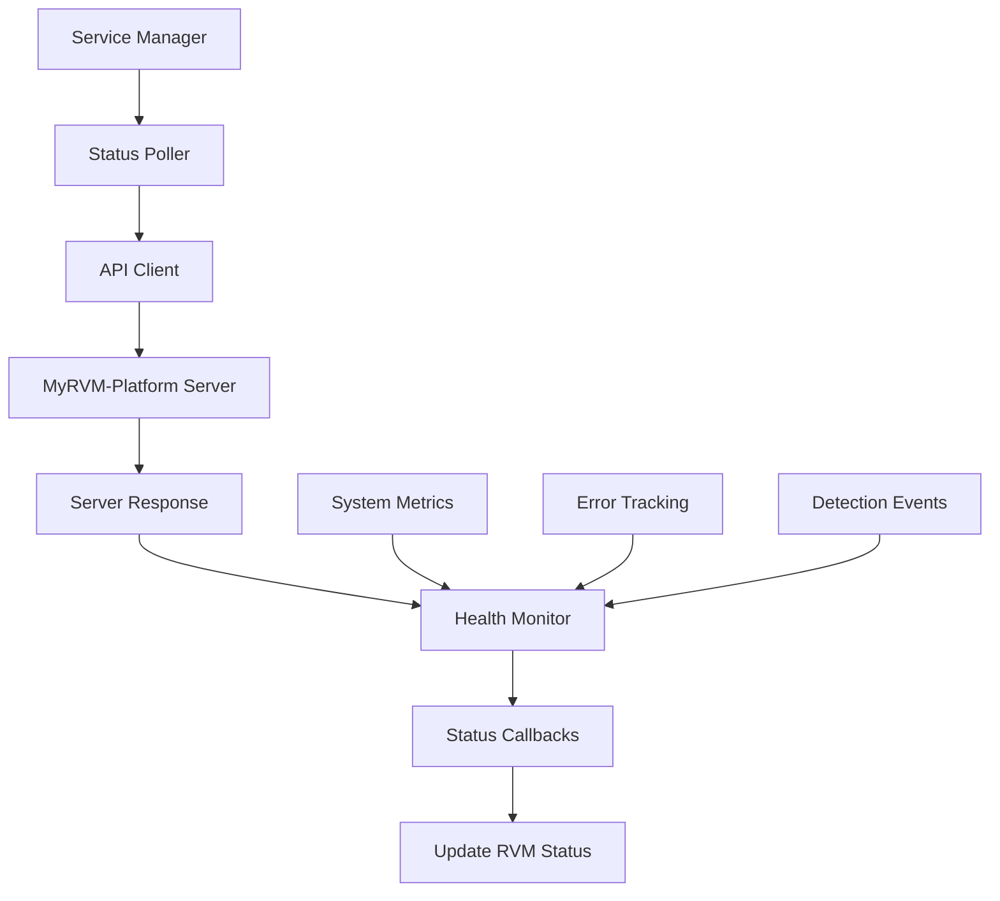

# RVM Polling Services

Services untuk polling status RVM dari MyRVM-Platform server. RVM dapat beroperasi normal atau dalam kondisi lainnya seperti maintenance.

## 📁 Struktur Services

```
utils/services/
├── __init__.py                      # Package initialization
├── api_client.py                   # API client untuk komunikasi dengan server
├── internal_health_monitor.py      # Internal health monitoring service
├── internal_status_poller.py       # Internal status polling service
├── internal_service_manager.py     # Internal service manager untuk mengelola semua services
├── internal_api_integration.py     # Internal integration dengan Jetson API
├── internal_polling_service.py     # Internal script untuk menjalankan services
└── README.md                       # Dokumentasi ini
```

## 🚀 Quick Start

### 1. Setup Configuration

Edit file `rvm_config.env`:

```bash
# RVM Platform Integration
RVM_API_BASE_URL=http://100.123.143.87:8001
RVM_API_KEY=your_master_api_key_here

# Polling Configuration
POLLING_INTERVAL=60  # Polling interval in seconds
MONITORING_INTERVAL=30  # Health monitoring interval in seconds
API_TIMEOUT=30  # API request timeout in seconds

# RVM IDs (comma-separated)
RVM_IDS=1,2,3
```

### 2. Run Services

```bash
# Start polling service
cd MySuperApps/MyCV-Platform/direct/app/api-hybrid-detection-jetson/utils/services
python3 run_polling_service.py

# Test connection
python3 run_polling_service.py --test-connection

# Show status
python3 run_polling_service.py --status

# Force poll all RVMs
python3 run_polling_service.py --force-poll
```

## 🔧 Services Overview

### 1. RVMAPIClient (`api_client.py`)

**Purpose**: Handles communication with MyRVM-Platform server

**Key Methods**:
- `get_rvm_status(rvm_id)` - Get RVM status from server
- `update_rvm_health(rvm_id, health_data)` - Update health data
- `report_detection(rvm_id, detection_data)` - Report detection results
- `get_rvm_config(rvm_id)` - Get RVM configuration
- `test_connection()` - Test server connection

**Usage**:
```python
from api_client import RVMAPIClient

client = RVMAPIClient(
    base_url='http://100.123.143.87:8001',
    api_key='your_api_key',
    timeout=30
)

success, response = client.get_rvm_status(1)
if success:
    print(f"RVM Status: {response['data']['rvm']['status']}")
```

### 2. RVMHealthMonitor (`health_monitor.py`)

**Purpose**: Tracks and manages RVM health metrics

**Key Features**:
- System metrics collection (CPU, memory, disk, GPU)
- Health score calculation
- Error tracking
- Detection event recording

**Usage**:
```python
from internal_health_monitor import RVMHealthMonitor

monitor = RVMHealthMonitor(rvm_id=1, monitoring_interval=30)
monitor.start_monitoring()

# Get health summary
health_summary = monitor.get_health_summary()
print(f"Health Score: {health_summary['health_score']}")
print(f"System Health: {health_summary['system_health']}")
```

### 3. RVMStatusPoller (`status_poller.py`)

**Purpose**: Main service for polling RVM status from server

**Key Features**:
- Automatic status polling
- Health data collection
- Status callbacks
- Error handling and retry logic

**Usage**:
```python
from internal_status_poller import RVMStatusPoller

def on_status_update(status):
    print(f"RVM Status: {status['rvm_status']}")

poller = RVMStatusPoller(rvm_id=1, config_file='rvm_config.env')
poller.add_status_callback(on_status_update)
poller.start_polling()

# Get current status
status = poller.get_current_status()
```

### 4. RVMServiceManager (`service_manager.py`)

**Purpose**: Manages multiple RVM polling services

**Key Features**:
- Multi-RVM management
- Service lifecycle control
- Unified status interface
- Configuration management

**Usage**:
```python
from internal_service_manager import RVMServiceManager

manager = RVMServiceManager('rvm_config.env')

# Start all services
manager.start_all_services()

# Get status for specific RVM
status = manager.get_rvm_status(1)

# Get all status
all_status = manager.get_all_status()

# Stop all services
manager.stop_all_services()
```

## 📊 RVM Status Types

Server dapat mengembalikan status berikut:

- **`active`** - RVM beroperasi normal
- **`inactive`** - RVM tidak aktif  
- **`maintenance`** - RVM dalam mode maintenance
- **`full`** - RVM penuh
- **`error`** - RVM mengalami error
- **`unknown`** - Status tidak diketahui

## 🔄 Polling Flow



## 📈 Health Monitoring

### Health Score Calculation

Health score dihitung berdasarkan:

1. **CPU Usage** (0-100, lower is better)
2. **Memory Usage** (0-100, lower is better)  
3. **Disk Usage** (0-100, lower is better)
4. **API Response Time** (0-100, lower is better)

### System Health Levels

- **`excellent`** - Health score ≥ 80
- **`good`** - Health score ≥ 60
- **`fair`** - Health score ≥ 40
- **`poor`** - Health score ≥ 20
- **`critical`** - Health score < 20

## 🛠️ Configuration

### Environment Variables

```bash
# Server Configuration
RVM_API_BASE_URL=http://100.123.143.87:8001
RVM_API_KEY=your_master_api_key_here

# Polling Configuration  
POLLING_INTERVAL=60  # Polling interval in seconds
MONITORING_INTERVAL=30  # Health monitoring interval in seconds
API_TIMEOUT=30  # API request timeout in seconds

# RVM Configuration
RVM_IDS=1,2,3  # Comma-separated RVM IDs
```

### API Endpoints

**Server Endpoints**:
- `GET /api/v2/rvm-status/{rvm_id}` - Get RVM status
- `POST /api/v2/rvm-health/{rvm_id}` - Update RVM health
- `POST /api/v2/rvm-detection/{rvm_id}` - Report detection
- `GET /api/v2/rvm-config/{rvm_id}` - Get RVM config
- `GET /api/v2/health` - Server health check

## 🚀 Usage Examples

### 1. Basic Polling

```python
from internal_service_manager import RVMServiceManager

# Initialize manager
manager = RVMServiceManager('rvm_config.env')

# Start all services
manager.start_all_services()

# Run forever
manager.run_forever()
```

### 2. Custom Status Callback

```python
from internal_status_poller import RVMStatusPoller

def custom_status_callback(status):
    rvm_id = status.get('rvm_id', 'unknown')
    rvm_status = status.get('rvm_status', 'unknown')
    connection = status.get('connection_status', 'unknown')
    
    print(f"RVM {rvm_id}: {rvm_status} (connection: {connection})")
    
    # Handle specific statuses
    if rvm_status == 'maintenance':
        print("RVM is in maintenance mode")
    elif rvm_status == 'full':
        print("RVM is full - stop accepting new items")
    elif rvm_status == 'error':
        print("RVM has error - check system")

# Create poller with callback
poller = RVMStatusPoller(rvm_id=1, config_file='rvm_config.env')
poller.add_status_callback(custom_status_callback)
poller.start_polling()
```

### 3. Health Monitoring

```python
from internal_health_monitor import RVMHealthMonitor

monitor = RVMHealthMonitor(rvm_id=1, monitoring_interval=30)
monitor.start_monitoring()

# Record detection event
monitor.record_detection({
    'timestamp': '2025-01-01T12:00:00Z',
    'object_count': 5,
    'confidence': 0.85
})

# Get health summary
health = monitor.get_health_summary()
print(f"Health Score: {health['health_score']:.1f}")
print(f"System Health: {health['system_health']}")
print(f"CPU Usage: {health['metrics']['cpu_usage_avg']:.1f}%")
print(f"Memory Usage: {health['metrics']['memory_usage_avg']:.1f}%")
```

### 4. Service Management

```python
from internal_service_manager import RVMServiceManager

manager = RVMServiceManager('rvm_config.env')

# Test connection
if manager.test_connection():
    print("✅ Server connection successful")
else:
    print("❌ Server connection failed")
    exit(1)

# Start services
manager.start_all_services()

# Get comprehensive status
summary = manager.get_service_summary()
print(f"Total RVMs: {summary['total_rvms']}")
print(f"Running: {summary['is_running']}")

# Get individual RVM status
for rvm_id in summary['rvm_ids']:
    status = manager.get_rvm_status(rvm_id)
    health = manager.get_health_summary(rvm_id)
    
    print(f"RVM {rvm_id}:")
    print(f"  Status: {status['rvm_status']}")
    print(f"  Health: {health['system_health']} ({health['health_score']:.1f})")
```

## 🔧 Command Line Interface

### Run Polling Service

```bash
# Start service normally
python3 run_polling_service.py

# With custom config
python3 run_polling_service.py --config custom_config.env

# With debug logging
python3 run_polling_service.py --log-level DEBUG
```

### Test Connection

```bash
# Test server connection
python3 run_polling_service.py --test-connection
```

### Show Status

```bash
# Show current status
python3 run_polling_service.py --status
```

### Force Poll

```bash
# Force immediate poll for all RVMs
python3 run_polling_service.py --force-poll
```

## 📊 Monitoring & Logging

### Log Files

- **Console Output**: Real-time status updates
- **Log File**: `rvm_polling_service.log` - Detailed logs

### Log Levels

- **DEBUG**: Detailed debugging information
- **INFO**: General information and status updates
- **WARNING**: Warning messages
- **ERROR**: Error messages

### Metrics Tracked

- API response times
- CPU usage
- Memory usage  
- Disk usage
- GPU usage (if available)
- Network I/O
- Detection count
- Error count
- Uptime

## 🚨 Error Handling

### Connection Errors

- **Timeout**: Automatic retry with exponential backoff
- **Connection Refused**: Log error and retry
- **Server Error**: Log error and continue polling

### Service Errors

- **Poller Crash**: Automatic restart
- **Health Monitor Error**: Log error and continue
- **Configuration Error**: Log error and use defaults

### Recovery

- **Automatic Restart**: Failed services are automatically restarted
- **Graceful Degradation**: Service continues with reduced functionality
- **Error Reporting**: All errors are logged and reported

## 🔒 Security

### API Authentication

- **Bearer Token**: API key authentication
- **Secure Headers**: Standard security headers
- **Timeout Protection**: Request timeout to prevent hanging

### Data Protection

- **Local Storage**: Health data stored locally
- **Secure Transmission**: HTTPS for API communication
- **Error Sanitization**: Sensitive data removed from logs

## 📚 Integration

### With MyCV-Platform

Services terintegrasi dengan MyCV-Platform untuk:

- **Status Monitoring**: Real-time RVM status
- **Health Tracking**: System health metrics
- **Detection Reporting**: Detection results to server
- **Configuration Updates**: Dynamic configuration from server

### With MyRVM-Platform

Services berkomunikasi dengan MyRVM-Platform untuk:

- **Status Polling**: Regular status checks
- **Health Reporting**: System health updates
- **Detection Sync**: Detection result synchronization
- **Configuration Sync**: Configuration updates

## 🎯 Best Practices

### 1. Configuration

- Use environment variables for sensitive data
- Set appropriate polling intervals
- Configure proper timeouts
- Use multiple RVM IDs for redundancy

### 2. Monitoring

- Monitor health scores regularly
- Set up alerts for critical statuses
- Track error rates and response times
- Monitor system resources

### 3. Error Handling

- Implement proper error callbacks
- Use retry logic for transient errors
- Log all errors for debugging
- Implement circuit breakers for persistent failures

### 4. Performance

- Use appropriate polling intervals
- Monitor resource usage
- Optimize health calculations
- Use connection pooling

## 🔄 Troubleshooting

### Common Issues

1. **Connection Timeout**
   - Check server URL and port
   - Verify network connectivity
   - Increase timeout value

2. **Authentication Failed**
   - Verify API key
   - Check server authentication
   - Update configuration

3. **High CPU Usage**
   - Increase polling interval
   - Reduce monitoring frequency
   - Check for infinite loops

4. **Memory Leaks**
   - Monitor deque sizes
   - Check for circular references
   - Restart services periodically

### Debug Mode

```bash
# Run with debug logging
python3 run_polling_service.py --log-level DEBUG
```

### Health Check

```bash
# Check service health
python3 run_polling_service.py --status
```

## 📞 Support

Untuk bantuan atau laporan bug, silakan buka issue di repository GitHub atau hubungi tim development.

---

**Version**: 1.5.0  
**Last Updated**: 2025-01-01  
**Compatibility**: MyCV-Platform 1.5.0+, MyRVM-Platform 2.0+
